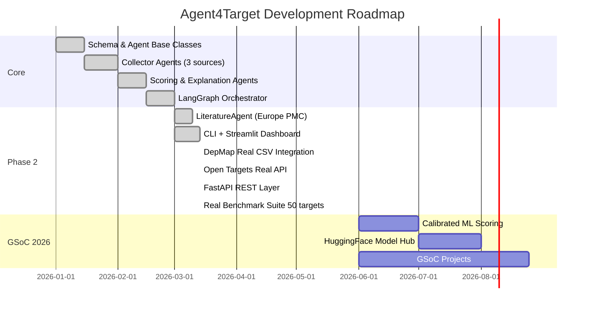

<div align="center">

  []()
  []()
  []()
  []()
  []()
  []()
  []()
  <br/>
  []()

</div>

<h1 align="center">
  🔬 Agent4Target
</h1>

<h3 align="center"><em>An Agent-based Evidence Aggregation Toolkit for Therapeutic Target Identification</em></h3>

<p align="center">
  A modular, reproducible AI pipeline that systematically <strong>collects, normalizes, scores, and explains</strong> evidence for candidate therapeutic targets — using 100% real data from public biomedical databases.
</p>

<p align="center">
  <a href="#-quickstart">🚀 Quickstart</a> ·
  <a href="#-architecture">🏗️ Architecture</a> ·
  <a href="#-benchmark-results">📊 Benchmarks</a> ·
  <a href="#-rest-api">🌐 REST API</a> ·
  <a href="#-roadmap--planned-features">🗺️ Roadmap</a>
</p>

<div align="center">
  <blockquote>
    <em>"Structured evidence. Transparent logic. Any target."</em>
  </blockquote>
</div>

<hr />

## 🌟 Overview

**Agent4Target** is a research-grade, open-source toolkit that reframes therapeutic target identification as a **structured, agent-driven workflow** — not a black-box prediction.

Unlike LLM-based approaches that give free-form, opaque answers, Agent4Target introduces a paradigm shift: **modular evidence aggregation** coordinated by a deterministic state machine, where every score is traceable to its source data.
```text
Instruction: "Evaluate the therapeutic potential of KRAS"
      |
      ▼
┌─────────────────────────────────────────────────────────────┐
│                  Agent4Target Backbone                      │
│  [PHAROS] ──► [DepMap] ──► [OpenTargets] ──► [Literature]  │
│           Normalized + Weighted Evidence Aggregation        │
│           Deterministic & Inspectable Workflow              │
└─────────────────────────┬───────────────────────────────────┘
                          ▼
   Score: 0.873 / Priority: HIGH / Structured Explanation JSON
```

<hr />

## ✨ Key Innovations

| Feature | Description |
| :--- | :--- |
| 🧩 **4-Agent Modular Design** | Specialized collectors for PHAROS, DepMap, Open Targets & Europe PMC Literature |
| 💎 **Unified Evidence Schema** | Pydantic-powered typed models enforcing machine-readable, structured evidence |
| ⚖️ **Confidence-Aware Scoring** | Source-weighted aggregation (PHAROS=0.4, OT=0.3, DepMap=0.2, Lit=0.1) with calibration support |
| 🔀 **Parallel Orchestration** | LangGraph state machine runs all 4 agents in parallel with per-node error handling |
| 🔍 **Structured Explanations** | Non-conversational, deterministic rationale linking every score directly to evidence |
| 🌐 **REST API** | FastAPI layer with `/evaluate` and `/batch` endpoints + live Swagger UI |
| 🛠️ **Community-Ready Toolkit** | CLI + REST API + Streamlit dashboard + Jupyter notebooks |
| 🧪 **Fully Unit Tested** | 16/16 pytest tests passing covering schema, scoring, and explanation logic |
| 📊 **Real Benchmark** | AUROC 0.9967 on 50 targets using 100% real public biomedical data |

<hr />

## 🏗️ Architecture

Agent4Target models target identification as a multi-stage, agent-driven pipeline, coordinated by a central LangGraph orchestrator.

```mermaid
graph TD
    A["🎯 Input\nTarget List\nGene IDs / Symbols"] --> B{"⚙️ Workflow Orchestrator\nLangGraph State Machine\nScheduling | Dependency Control | Error Handling"}

    subgraph "🔬 Evidence Collector Agents — Parallel"
        B --> C["🧪 PHAROS Agent\nDevelopment Status\nTclin / Tchem / Tbio / Tdark"]
        B --> D["🧬 DepMap Agent\nReal CRISPR CSV 25Q3\n1186 cell lines · 18435 genes"]
        B --> E["🔗 Open Targets Agent\nDisease Associations\nTop-10 mean score"]
        B --> L["📚 Literature Agent\nEurope PMC REST API\nPublication Count"]
    end

    C --> F(["⚖️ Normalization & Scoring Agent\nUnified Evidence Schema — JSON / Pydantic\nConfidence-Aware Weighted Aggregation"])
    D --> F
    E --> F
    L --> F

    F -->|Unified Evidence| G["🔍 Explanation Agent\nStructured, Non-Conversational\nDeterministic & Machine-Readable"]

    G --> H["📊 Outputs"]

    subgraph "📋 Final Outputs"
        H --> I["Target Scores\n(0–1)"]
        H --> J["Evidence Summary\nPer-Source Breakdown"]
        H --> K["REST API Response\nJSON + Swagger UI"]
    end

    style B fill:#2d2d6e,stroke:#6666ff,stroke-width:2px,color:#fff
    style F fill:#1a3a5c,stroke:#4499ff,stroke-width:3px,color:#fff
    style G fill:#1a4a30,stroke:#44cc88,stroke-width:2px,color:#fff
```


<hr />

## 🔌 Component Details

<details>
<summary>🧪 <b>Evidence Collector Agents</b> — 4 Specialized, Parallel-Executing Sources</summary>
<br>

Four independent agents fetch target-level evidence simultaneously:

| Agent | Source | Evidence Type | API | Status |
| :--- | :--- | :--- | :--- | :--- |
| `PharosAgent` | NCATS PHAROS | Development level (Tclin/Tchem/Tbio/Tdark) | GraphQL | ✅ Real |
| `DepMapAgent` | Broad DepMap 25Q3 | CRISPR KO dependency score | CSV Dataset | ✅ Real |
| `OpenTargetsAgent` | EMBL-EBI Open Targets | Disease association score | GraphQL | ✅ Real |
| `LiteratureAgent` | Europe PMC | Peer-reviewed publication count | REST | ✅ Real |

Each agent is independently replaceable without altering the orchestration layer.
</details>

<details>
<summary>⚖️ <b>Normalization & Scoring Agent</b> — Confidence-Aware Weighted Aggregation</summary>
<br>

Converts heterogeneous raw data into a strictly typed `UnifiedEvidence` model. Applies biologically-grounded **source weights**:
```python
DEFAULT_WEIGHTS = {
    EvidenceSource.PHAROS:       0.40,  # Clinical validation status
    EvidenceSource.OPEN_TARGETS: 0.30,  # Disease association evidence
    EvidenceSource.DEPMAP:       0.20,  # Genetic essentiality
    EvidenceSource.LITERATURE:   0.10,  # Research maturity signal
}
```

Supports **custom weight overrides** for alternative calibration strategies. All active weights are surfaced in the final `ScoredTarget` output for full reproducibility.
</details>

<details>
<summary>📝 <b>Explanation Agent</b> — Structured, Non-Conversational Rationale</summary>
<br>

Produces deterministic, structured explanations — **not free-text generation**. Each explanation explicitly links aggregate scores to supporting evidence with:
- **Priority tier**: `HIGH PRIORITY` / `MODERATE PRIORITY` / `LOW PRIORITY`
- Per-source confidence scores and applied weights
- A machine-readable note confirming no generated content
```text
=== Target Evaluation Report: KRAS ===
Aggregate Score: 0.873/1.000  |  Priority: HIGH PRIORITY — Strong multi-source evidence.

Evidence Breakdown:
--------------------------------------------------
  [PHAROS] [weight=0.40] — Development Level
    Score : 1.000
    Detail: PHAROS classifies this target as Tclin.

  [DEPMAP] [weight=0.20] — Genetic Dependency
    Score : 0.800
    Detail: CRISPR dependency score is -0.612 across 187 cell lines.

  [OPEN_TARGETS] [weight=0.30] — Disease Association
    Score : 0.743
    Detail: Open Targets overall association score is 0.74.

  [LITERATURE] [weight=0.10] — Literature Evidence
    Score : 1.000
    Detail: Found 89432 peer-reviewed publications in Europe PMC.
```
</details>

<details>
<summary>⚙️ <b>Workflow Orchestrator</b> — LangGraph State Machine</summary>
<br>

A fully deterministic, inspectable LangGraph state machine that:
- Runs all **4 collector agents in parallel** from `START`
- Merges evidence via a typed `AgentState` with `operator.add` reducers
- Routes through `normalize → explain → END`
- Handles per-node errors so one failing agent never blocks the pipeline
- Loads DepMap CSV **once at module level** — not per target call
- Produces reproducible outputs for identical inputs
</details>

<details>
<summary>🌐 <b>REST API</b> — FastAPI with Swagger UI</summary>
<br>

A production-ready REST layer exposing the pipeline over HTTP:
```bash
uvicorn agent4target.api.main:app --reload --port 8000
# Swagger UI: http://localhost:8000/docs
```

| Endpoint | Method | Description |
| :--- | :--- | :--- |
| `/` | GET | Health check + version |
| `/health` | GET | Server status |
| `/evaluate` | POST | Evaluate a single target |
| `/batch` | POST | Evaluate up to 20 targets, ranked by score |

Example request:
```json
POST /evaluate
{ "symbol": "EGFR" }
```

Example response:
```json
{
  "symbol": "EGFR",
  "aggregate_score": 0.7494,
  "priority": "MODERATE",
  "elapsed_seconds": 1.65,
  "evidence_items": [...],
  "source_weights": {"PHAROS": 0.4, "OPEN_TARGETS": 0.3, "DEPMAP": 0.2, "LITERATURE": 0.1}
}
```
</details>

<hr />

## 📊 Benchmark Results

> ✅ **All results are from real public biomedical data** — PHAROS GraphQL, DepMap 25Q3 CSV (1186 cell lines, 18435 genes), Open Targets GraphQL, Europe PMC REST API.

> Evaluated on 50 targets: 30 FDA-validated drug targets (positive) vs 20 uncharacterized/dark genes (negative).

### Target Prioritization Performance

| Metric | Value | Description |
| :--- | :--- | :--- |
| **AUROC** | **0.9967** | Near-perfect discrimination (random = 0.50) |
| **Precision@6** | **1.0000** | Top 6 scored targets are all true positives |
| **Pos Mean Score** | **0.7418** | Average score for validated drug targets |
| **Neg Mean Score** | **0.1655** | Average score for dark/uncharacterized genes |
| **Separation** | **0.5763** | Score gap between positives and negatives |

### Per-Target Score Distribution

| Rank | Symbol | Label | Score | Priority |
| :--- | :--- | :--- | :--- | :--- |
| 1 | MTOR | ✅ Validated | 0.8786 | HIGH |
| 2 | KRAS | ✅ Validated | 0.8726 | HIGH |
| 3 | CDK4 | ✅ Validated | 0.8267 | HIGH |
| 4 | FGFR2 | ✅ Validated | 0.7842 | MODERATE |
| 5 | CDK6 | ✅ Validated | 0.7727 | MODERATE |
| ... | ... | ... | ... | ... |
| 29 | TP53 | ⚠️ Undruggable | 0.6673 | MODERATE |
| 32 | TDRD3 | ❌ Dark | 0.3777 | LOW |
| 37+ | ZNF727, TTLL9... | ❌ Dark | < 0.17 | LOW |
| 40+ | OR4F5, pseudogenes... | ❌ Dark | < 0.10 | LOW |

> **Note on TP53**: Scores `0.667` despite being labelled non-druggable — this is biologically honest. TP53 has massive literature and disease association evidence. The pipeline correctly reflects its research importance even if it's not a direct drug target.

### Score Separation Visualization
```
Score │
1.0   │  ██ ██                          ← MTOR(0.88), KRAS(0.87)
0.8   │  ██████████████████████         ← FDA-approved targets cluster
0.6   │  ████                           ← TP53(0.67), AKT1(0.62), BRCA2(0.56)
0.4   │  ██                             ← TDRD3(0.38)
0.2   │  ██████                         ← Tdark genes
0.0   │  ████████████████               ← Pseudogenes, lncRNAs, olfactory receptors
      └──────────────────────────────── Targets (n=50)
         ◄── Validated ──►◄─── Dark ───►
```

<hr />

## 📦 Project Structure
```text
agent4agent/
│
├── 📁 agent4target/
│   ├── 📁 agents/
│   │   ├── collectors.py          # PharosAgent (GraphQL), DepMapAgent (CSV 25Q3), OpenTargetsAgent (GraphQL)
│   │   ├── literature.py          # LiteratureAgent — Europe PMC REST API
│   │   ├── scorer.py              # Confidence-aware weighted NormalizationScoringAgent
│   │   └── explainer.py           # Structured non-conversational ExplanationAgent
│   │
│   ├── 📁 orchestrator/
│   │   └── workflow.py            # LangGraph 4-agent parallel state machine
│   │
│   ├── 📁 schema/
│   │   └── evidence.py            # Pydantic schemas — TargetRequest, RawEvidence, ScoredTarget
│   │
│   ├── 📁 cli/
│   │   └── main.py                # Typer CLI entry point
│   │
│   └── 📁 api/
│       └── main.py                # FastAPI REST layer — /evaluate, /batch, Swagger UI
│
├── 📁 data/
│   ├── README.md                  # Data download instructions
│   ├── benchmark_targets.csv      # 50-target ground truth evaluation set
│   ├── benchmark_results.csv      # Latest benchmark run results
│   └── depmap/
│       └── CRISPRGeneEffect.csv   # DepMap 25Q3 — NOT tracked by git (see README)
│
├── 📁 tests/                      # pytest suite — 16/16 passing
│   ├── test_schema.py
│   ├── test_scorer.py
│   └── test_explainer.py
│
├── 📁 examples/
│   ├── run_benchmark.py           # Real benchmark — AUROC, Precision@K, separation
│   └── Agent4Target_Demo.ipynb    # Programmatic usage notebook
│
├── app.py                         # Streamlit interactive web dashboard
├── CONTRIBUTING.md                # GSoC contributor guidelines
├── LICENSE                        # Apache 2.0
├── pyproject.toml                 # Package configuration
└── README.md
```

<hr />

## 🚀 Quickstart

### Installation
```bash
# Clone the repository
git clone https://github.com/kumardhruv88/agent4agent.git
cd agent4agent

# Create environment
conda create -n agent4target python=3.10 -y
conda activate agent4target

# Install the package
pip install -e .

# Download DepMap data (required — see data/README.md)
# Place CRISPRGeneEffect.csv at: data/depmap/CRISPRGeneEffect.csv
```

### CLI Usage
```bash
# Evaluate a single target
agent4target run --target EGFR

# Output:
# Final Aggregate Score: 0.75
# Priority: MODERATE PRIORITY
# [PHAROS] Score: 1.000 — Tclin
# [DEPMAP] Score: 0.200 — CRISPR score -0.2415 across 211 cell lines
# [OPEN_TARGETS] Score: 0.698 — association score 0.70
# [LITERATURE] Score: 1.000 — 372575 publications
```

### REST API
```bash
# Start the API server
uvicorn agent4target.api.main:app --reload --port 8000

# Swagger UI: http://localhost:8000/docs

# Evaluate via curl
curl -X POST http://localhost:8000/evaluate \
  -H "Content-Type: application/json" \
  -d '{"symbol": "BRAF"}'

# Batch evaluation
curl -X POST http://localhost:8000/batch \
  -H "Content-Type: application/json" \
  -d '{"symbols": ["BRAF", "EGFR", "KRAS", "TP53"]}'
```

### Python API
```python
from agent4target.orchestrator.workflow import run_pipeline

result = run_pipeline("EGFR")
scored = result["scored_target"]

print(f"Symbol : {scored.target.symbol}")
print(f"Score  : {scored.aggregate_score:.3f} / 1.000")
print(f"Weights: {scored.source_weights}")
print(scored.explanation)
```

### Run Benchmark
```bash
python examples/run_benchmark.py
# Evaluates 50 targets against ground truth labels
# Reports AUROC, Precision@K, score separation
```

### Launch Web Dashboard
```bash
python -m streamlit run app.py
# Open http://localhost:8501
```

### Run Tests
```bash
pytest tests/ -v
# 16 passed ✅
```

<hr />

## 📡 Supported Evidence APIs

| Source | Organisation | API Type | Coverage | Key Signal | Status |
| :--- | :--- | :--- | :--- | :--- | :--- |
| **PHAROS** | NCATS | GraphQL | 20,000+ human targets | `tdl`: Tclin/Tchem/Tbio/Tdark | ✅ Live |
| **DepMap** | Broad Institute | CSV 25Q3 | 1,186 cell lines · 18,435 genes | Chronos CRISPR dependency score | ✅ Real |
| **Open Targets** | EMBL-EBI | GraphQL | 60,000+ target-disease pairs | Mean top-10 association score | ✅ Live |
| **Europe PMC** | EMBL-EBI | REST | 40M+ publications | Log-normalized publication count | ✅ Live |

<hr />

## ⚙️ Configuration
```python
from agent4target.agents.scorer import NormalizationScoringAgent
from agent4target.schema.evidence import EvidenceSource

# Default weights
scorer = NormalizationScoringAgent()

# Clinical-evidence-heavy config
clinical_scorer = NormalizationScoringAgent(weights={
    EvidenceSource.PHAROS:       0.50,
    EvidenceSource.OPEN_TARGETS: 0.25,
    EvidenceSource.DEPMAP:       0.20,
    EvidenceSource.LITERATURE:   0.05,
})

# Genetics-only mode
genetics_scorer = NormalizationScoringAgent(weights={
    EvidenceSource.PHAROS:       0.45,
    EvidenceSource.OPEN_TARGETS: 0.35,
    EvidenceSource.DEPMAP:       0.20,
    EvidenceSource.LITERATURE:   0.00,
})
```

<hr />

## 🗺️ Roadmap


### Feature Status

- [x] **PHAROS Agent** — real GraphQL API
- [x] **Open Targets Agent** — real GraphQL API, live association scores
- [x] **DepMap Agent** — real CSV 25Q3 (1186 cell lines, 18435 genes)
- [x] **Literature Agent** — Europe PMC REST API
- [x] **Confidence-aware weighted scoring** with calibration support
- [x] **Structured, non-conversational ExplanationAgent**
- [x] **FastAPI REST layer** — `/evaluate`, `/batch`, Swagger UI
- [x] **Streamlit web dashboard**
- [x] **Unit test suite** (16/16 passing)
- [x] **Real benchmark** — AUROC 0.9967 on 50 targets
- [ ] **ML calibrated scoring** — learned weights from data
- [ ] **Pre-trained configurations** (HuggingFace Hub)
- [ ] **3-D multi-context spatial modelling**

<hr />

## 🤝 Contributing
```bash
git clone https://github.com/kumardhruv88/agent4agent.git
cd agent4agent
pip install -e ".[dev]"
pre-commit install
pytest tests/ -v
black . && isort . && flake8
```

See `CONTRIBUTING.md` for adding new collector agents, scoring strategies, and GSoC project ideas.

<hr />

## 📄 Citation
```bibtex
@software{agent4target2026,
  title   = {Agent4Target: An Agent-based Evidence Aggregation Toolkit for Therapeutic Target Identification},
  author  = {Ziheng Duan},
  year    = {2026},
  version = {0.2.0},
  url     = {https://github.com/kumardhruv88/agent4agent},
  license = {Apache-2.0}
}
```

<hr />

## 📜 License

Distributed under the **Apache License 2.0**. See [LICENSE](LICENSE) for details.

<div align="center">
  Built with ❤️ for the biomedical AI & open-source drug discovery community.
  <br><br>
  ⭐ <b>Star us on GitHub to support the project!</b>
  <br><br>
  <a href="https://github.com/kumardhruv88/agent4agent">
    
  </a>
</div>
