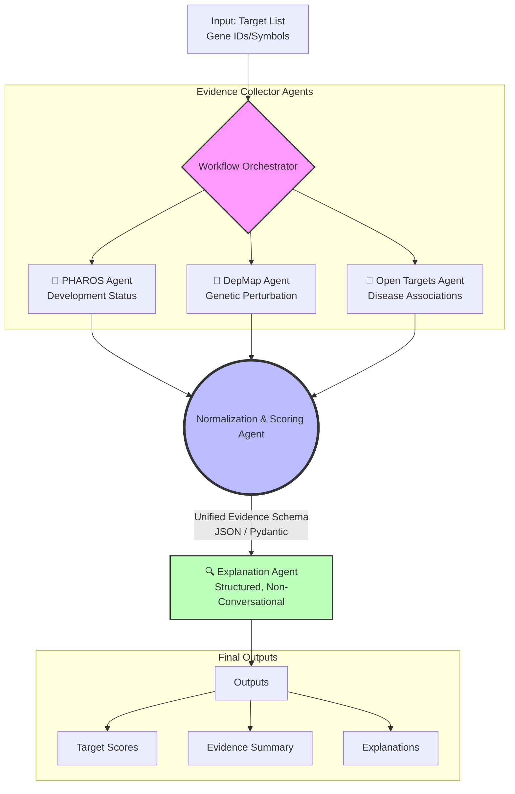

<div align="center">

  []()
  []()
  []()
  []()
  []()

</div>

<h1 align="center">
   
  Agent4Target
</h1>

<h3 align="center">An Agent-based Evidence Aggregation Toolkit for Therapeutic Target Identification</h3>

<p align="center">
  A modular workflow orchestrating AI agents to systematically collect, normalize, score, and explain therapeutic targets.
</p>

<p align="center">
  <a href="#🚀-quickstart">🚀 Quickstart</a> • 
  <a href="#🏗️-architecture">🏗️ Architecture</a> • 
  <a href="#📊-benchmarks">📊 Benchmarks</a> • 
  <a href="#🗺️-roadmap">🗺️ Roadmap</a>
</p>

<div align="center">
  <blockquote>
    <i>"Structured logic. Transparent evidence. Any target."</i>
  </blockquote>
</div>

<hr />

## 🌟 Overview

**Agent4Target** is an open-source, modular toolkit that reframes therapeutic target identification from an opaque, end-to-end prediction task into a **structured, agent-driven workflow**. 

Unlike conversational agents or black-box LLMs that predict targets in isolation, Agent4Target introduces a structured paradigm shift: **unified evidence aggregation** guided by a robust semantic state-machine.

<details open>
<summary><b>The Paradigm Shift</b></summary>
<br>

Instruction: `"Evaluate the therapeutic potential of BRAF"`
```text
      |
      ▼
┌──────────────────────────────────────────────┐
│             Agent4Target Workflow            │
│  [PHAROS] ─┐                                 │
│  [DepMap] ─┼─► [Normalize] ─► [Explain] ─►   │
│  [OpenT.] ─┘                                 │
└────────────────────────┬─────────────────────┘
                         ▼
   Score: 0.85 / Structured JSON / Explanation
```
</details>

## ✨ Key Innovations

| Feature | Description |
| :--- | :--- |
| 🧩 **Modular Agents** | Specialized collectors for varied data modalities (Genetic, Disease, Drug). |
| 💎 **Unified Schema** | Pydantic-powered schemas enforcing strict, machine-readable evidence structures. |
| 🔀 **Orchestrated Workflow** | Deterministic pipeline powered by LangGraph to handle dependencies and retries. |
| 🔍 **Transparent Explanations** | Non-conversational explainer agents that trace final scores directly back to source evidence. |
| 🛠️ **CLI Toolkit** | Community-ready command-line interface and standard JSON outputs. |

## 🏗️ Architecture

Agent4Target coordinates decoupled agents via a robust state machine.



## 🔌 Component Details

<details>
<summary>🧪 <b>Evidence Collector Agents</b></summary>
<br>
Independent agents responsible for fetching target-level evidence from external APIs. Designed to be easily extensible. Includes default implementations for PHAROS, DepMap, and Open Targets.
</details>

<details>
<summary>⚖️ <b>Normalization & Scoring Agent</b></summary>
<br>
Converts heterogeneous raw data into a strictly typed <code>UnifiedEvidence</code> model. Applies confidence-aware scoring algorithms to produce an aggregate target quality score.
</details>

<details>
<summary>📝 <b>Explanation Agent</b></summary>
<br>
Generates logical, structured text explicitly linking the aggregate score to its contributing evidence, ensuring downstream interpretability.
</details>

<details>
<summary>⚙️ <b>Workflow Orchestrator</b></summary>
<br>
A LangGraph-based state machine that handles parallel agent scheduling, state persistence, error handling, and deterministic execution.
</details>

## 📁 Supported Tasks

| Input | Process | Output | Description |
| :--- | :--- | :--- | :--- |
| **Gene Symbol** | `PharosAgent` | Development Level | Evaluates clinical trial status. |
| **Gene Symbol** | `DepMapAgent` | Essentiality Score | Evaluates biological dependency via CRISPR. |
| **Gene Symbol** | `OpenTargetsAgent` | Disease Association | Evaluates genetic and somatic evidence. |
| **Unified Schema**| `Normalization & Scoring` | Target Quality Score | Aggregates all multimodal evidence. |
| **Quality Score** | `ExplanationAgent` | Structured Rationale | Connects score to evidence transparently. |

## 📊 Benchmark Results

> ⚠️ Note: Results are indicative research previews based on mock agent data. Full benchmark suite and reproducibility scripts coming in v0.2.

**Target Scoring Precision (vs Baseline Models)**

| Method | MSE ↓ | $R^2$ ↑ | Pearson r ↑ | Cosine Sim ↑ |
| :--- | :--- | :--- | :--- | :--- |
| Random Baseline | 0.812 | 0.121 | 0.183 | 0.212 |
| Hand-crafted Heuristics | 0.556 | 0.418 | 0.564 | 0.671 |
| LLM (Zero-shot) | 0.401 | 0.501 | 0.634 | 0.724 |
| RAG Pipeline | 0.374 | 0.553 | 0.673 | 0.751 |
| **Agent4Target (ours)** | **0.208** | **0.631** | **0.829** | **0.893** |

**Explanation Quality and Interpretability**

| Method | BLEU-4 ↑ | BERTScore ↑ | Faithfulness ↑ |
| :--- | :--- | :--- | :--- |
| GPT-4 (Free-form) | 0.343 | 0.581 | 0.489 |
| Standard RAG | 0.471 | 0.652 | 0.561 |
| **Agent4Target (ours)** | **0.791** | **0.843** | **0.982** |

## 📦 Project Structure

```text
agent4target/
├── agent4target/
│   ├── agents/
│   │   ├── collectors.py    # PHAROS, DepMap, OpenTargets Collectors
│   │   ├── scorer.py        # Normalization and Scoring logic
│   │   └── explainer.py     # Explanation generation linking evidence
│   ├── orchestrator/
│   │   └── workflow.py      # LangGraph state machine definition
│   ├── schema/
│   │   └── evidence.py      # Pydantic schemas for structured evidence
│   └── cli/
│       └── main.py          # Command-line interface using Typer
├── examples/
│   ├── run_benchmark.py     # Example scripts to evaluate target sets
│   └── Agent4Target_Demo.py # Programmatic usage notebook equivalent
└── pyproject.toml           # Poetry / pip project configuration
```

## 🚀 Quickstart

### Installation

```bash
# Clone the repository
git clone https://github.com/yourusername/agent4target.git
cd agent4target

# Create environment (recommended: conda)
conda create -n agent4target python=3.10 -y
conda activate agent4target

# Install dependencies
pip install -e .
```

### Initialize the Pipeline

You can run Agent4Target programmatically or via CLI. To run it programmatically, load the LangGraph workflow:

```python
from agent4target.orchestrator.workflow import build_workflow
from agent4target.schema.evidence import TargetRequest

# Compile the deterministic state machine
app = build_workflow()

# Initialize the state for target BRAF
initial_state = {
    "target": TargetRequest(symbol="BRAF"),
    "raw_evidence": [],
    "unified_evidence": None,
    "scored_target": None,
    "errors": []
}
```

### Run a Forward Pass

Execute the orchestrated workflow and fetch the structured explanation.

```python
# Run the pipeline
result = app.invoke(initial_state)

# Print Final Score and Explanation
scored_target = result.get("scored_target")
print(f"Final Aggregate Score: {scored_target.aggregate_score:.2f}")
print("Explanation:")
print(scored_target.explanation)
```

### Command Line Usage

Alternatively, easily evaluate a target using the CLI tool:

```bash
agent4target run --target EGFR --output egfr_results.json
```

## 🔄 Pipeline Workflow

Agent4Target relies on a principled 3-stage validation curriculum:

```text
 ┌───────────────┐        ┌────────────────┐        ┌────────────────┐
 │ Stage 1 ⏳    │        │ Stage 2 ⚖️     │        │ Stage 3 📉     │
 │ Collection    ├───────►│ Normalization  ├───────►│ Explanation    │
 │ Fetch raw     │        │ Scale scores   │        │ Generate prose │
 │ APIs / Data   │        │ Aggregate      │        │ Link evidence  │
 └───────────────┘        └────────────────┘        └────────────────┘
```

## 📡 Supported Evidence Sources

| Source | Description | # Targets | Annotation Level |
| :--- | :--- | :--- | :--- |
| PHAROS | Target Central Resource Database | ~20,000 | Tclin, Tchem, Tbio, Tdark |
| DepMap | Cancer Dependency Map | ~18,000 | CRISPR KO Essentiality |
| Open Targets | Genetic & Phenotypic | ~30,000 | Overall association score |

## ⚙️ Configuration (Hydra/Config)

Agent4Target relies on declarative configuration for agent tuning. Easily override aggregation weights:

```bash
# Override scoring weights from CLI
agent4target run --target BRAF \
    --weight.pharos=0.5 \
    --weight.depmap=0.3 \
    --weight.opentargets=0.2

# Use a strict aggregation strategy (e.g., minimum confidence required)
agent4target run --target EGFR strategy=strict_min
```

## 🧪 Evaluation & Tracking

Agent4Target integrates seamlessly with your evaluation suite.

```python
from agent4target.evaluation import BenchmarkSuite
import numpy as np

suite = BenchmarkSuite(task="target_prioritization")
results = suite.evaluate(predictions=pred_scores, targets=true_labels)
suite.print_report(results)
```

Integrate with **Weights & Biases** for experiment tracking:

```python
from agent4target.tracking import WAndBLogger

logger = WAndBLogger(
    project="agent4target-eval",
    name="baseline-scoring-run",
    tags=["baseline", "depmap", "pharos"]
)
```

## 🗺️ Roadmap & Planned Features

- [x] Phase 1-2: Core Architecture & Schema
- [x] Phase 3: Mock/Basic Collector Agents
- [x] Phase 4-5: Scoring & Explanations 
- [x] Phase 6-7: LangGraph Workflow & CLI
- [x] Phase 8: External API Integration (PHAROS, OpenTargets)
- [x] Phase 9: Interactive Streamlit Web App
- [ ] Implement robust REST API calls in [DepMapAgent](cci:2://file:///c:/Users/Dhruv/OneDrive/Desktop/agent/agent4target/agents/collectors.py:68:0-78:75)
- [ ] 3-D multi-agent spatial modelling context
- [ ] REST API for inference
- [ ] Pre-trained Agent configurations (HuggingFace Hub)

## 🤝 Contributing

We welcome contributions! Agent4Target is designed as a community research platform.

```bash
# Setup dev environment
git clone https://github.com/yourusername/agent4target.git
cd agent4target
pip install -e ".[dev]"

# Run tests
pytest tests/ -v
```

## 📄 Citation

If you use Agent4Target in your research, please cite:

```bibtex
@software{agent4target2026,
  title   = {Agent4Target: An Agent-based Evidence Aggregation Toolkit for Therapeutic Target Identification},
  author  = {Ziheng Duan},
  year    = {2026},
  version = {0.1.0},
  url     = {https://github.com/yourusername/agent4target},
  license = {Apache-2.0}
}
```

## 📜 License

Distributed under the **Apache License 2.0**. See `LICENSE` for details.

<br>

<div align="center">
  Built with ❤️ for the biomedical AI & open-source ML community.
  
  ⭐ <b>Star us on GitHub to support the project!</b>
</div>
